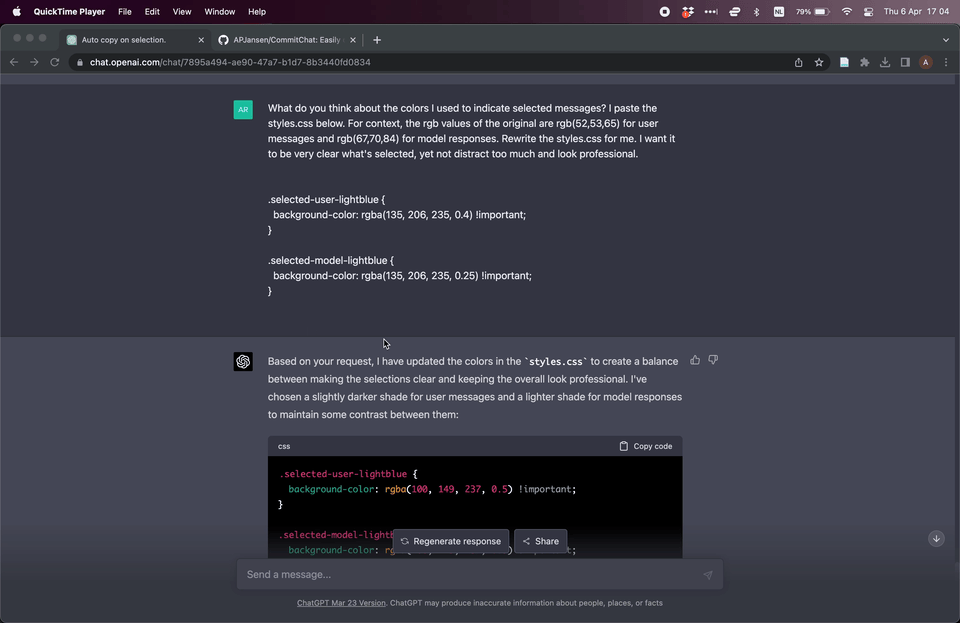

# CommitChat
Easily copy ChatGPT conversations to add to Github commits.

To share how you used GPT, it would be useful to link the relevant pieces of the conversation to the corresponding commit.
Without an API for GPT4 this is quite tedious.
This extension is meant to simplify that process.

Here is a quick demo, I've asked GPT4 to suggest some changes to this repo, done that and committed the changes.
Then I click to copy the chat and press ctrl+v to paste it as a comment on the commit.

## Usage
1. Go to https://chat.openai.com/chat
2. Click on the relevant prompts\*, both prompt and answer are selected.

\*: not on the text itself but on the blank space to the left of it.

The messages will now be in your clipboard, ordered chronologically and formatted for github.

4. Paste as a comment on the related commit.
5. Press ctrl+shift+x to unselect everything (or click on the prompts again).

## Installation
To install this as a chrome extension,
1. Download or clone this repository
3. Go to `chrome://extensions/` in your browser
4. Turn on developer mode (top right)
5. Click "Load Unpacked"
6. Select the dist folder

## Modifying
To make changes, modify the files in the src folder, then:
1. Make sure node.js and npm are installed.
2. Run `npm install` to install necessary dependencies.
3. Make any changes to files in the src folder.
4. Run `npm run build`, this will update the dist folder.
5. Reload in chrome.

